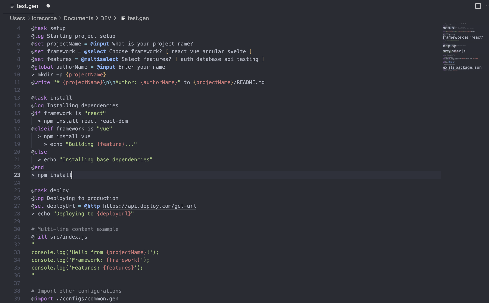

# (my-gen AKA) gen


**gen** is a simple, command runner for Node.js. It interprets a custom DSL to automate file operations, variable management, shell commands, and conditional logic for project scaffolding and scripting tasks. Why not use Bash, Python, Make, or Just...? Because it is fun to create a new language and a new tool! 😄

## Scope
- Parse and execute a custom DSL for project generation and scripting
- Support for variables, user input, file and folder operations, HTTP requests, and shell commands
- Extensible with new commands
- Designed for automation, scaffolding, and scripting in Node environments

## Usage

Install globally:
```bash
npm install -g my-gen
```
Create a `.gen` file with a list of commands and use like this:
```bash
gen --file <path/to/your.gen> --output <path/to/output/dir>
```

- `--file`: Path to the `.gen` script to execute (Default: current directory).
- `--output`: Optional path to the directory where commands will be executed. (Default: current directory)
- `--config`: Optional path to a JSON file to pre-populate the context.
- `--verbose`: Optional path to enable verbose logging.
- `--doc`: Convert the `.gen` file to markdown documentation.
- `--list`: List available templates from the repository.
- `--template=<name>`: Download and execute a template from the repository.
- `--force`: Force refresh of template cache (use with `--list`).
- `--init`: Create a basic `.gen` file to start your automation.

## Getting Started

### Creating Your First .gen Script

If you're new to gen, start by creating a basic template:
```bash
# Create a starter .gen file in the current directory
gen --init
```

This command creates a `template.gen` file with example commands and comments to help you understand the DSL syntax. You can then customize this file for your specific automation needs.

## .gen file SYNTAX & DSL Example
**.gen** file contains commands line by line based on a simple custom Domain Specific Language. 


## Front Matter Metadata

.gen files support Front Matter metadata at the beginning of the file to provide structured information about the script:

```yaml
---
author: Lorenzo Corbella
version: 1.2.0
description: React + TypeScript starter with modern tooling
tags: [react, typescript, vite]
requires: [node>=18.0.0, git, npm, code]
links: [https://vitejs.dev/,https://react.dev/]
---
```

### Metadata Fields

| Field | Type | Description |
|-------|------|-------------|
| `author` | string | Author name or organization |
| `version` | string | Template version (semantic versioning recommended) |
| `description` | string | Brief description of what the template does |
| `tags` | array | Keywords to categorize the template |
| `requires` | array | Required tools, runtimes, or dependencies (e.g., node>=18.0.0, git, npm, docker) |
| `links` | array | Relevant documentation or resource links |

### Benefits of Metadata

- **Better Discovery**: Template descriptions are used in `gen --list` output
- **Version Tracking**: Keep track of template versions and updates
- **Requirements**: Clearly specify dependencies and prerequisites in a single array
- **Documentation**: Automatic logging of metadata when templates execute
- **Organization**: Tags help categorize and find relevant templates

### Metadata Display

When executing a .gen file with metadata, the information is automatically displayed:

```
📋 Script Metadata:
   Description: React + TypeScript starter with modern tooling
   Author: Lorenzo Corbella
   Version: 1.2.0
   Tags: react, typescript, vite, testing
   Requires: node>=18.0.0, git, npm, code
   Links: https://vitejs.dev/, https://react.dev/
```


## Supported Commands

| Command    | Syntax Example                                 | Description                                                                                 |
|------------|------------------------------------------------|---------------------------------------------------------------------------------------------|
| [`@log`](doc/commands/log.md)       | `@log Hello, world!`                           | Print a message to the console (supports variable interpolation)                            |
| [`@set`](doc/commands/set.md)       | `@set name = value`<br>`@set x = @input Prompt`<br>`@set y = @select Choose? [ a b c ]`<br>`@set z = @confirm Continue?`   | Set variables, prompt for input/selection/confirmation, load files, fetch HTTP, list files/folders |
| [`@global`](doc/commands/global.md) | `@global name = value`<br>`@global x = @input Prompt`   | Same as @set but saves variables permanently |
| [`@ai`](doc/commands/ai.md)         | `@set reply = @ai What is Node.js?`            | Send a prompt to Ollama AI and get a response (configurable via global variables)          |
| [`>`](doc/commands/shell.md)   | `> echo Hello`                                 | Run a shell command                                                                         |
| [`@write`](doc/commands/write.md)   | `@write "content" to path`<br>`@write var to path` | Write literal or variable content to a file (relative paths are considered from the pwd)         |
| [`@fill`](doc/commands/fill.md)     | `@fill path/to/file.txt`<br>`"`<br>`content here`<br>`"` | Write multi-line content to a file using quote delimiters  (relative paths are considered from the pwd)                                 |
| [`@if`](doc/commands/if.md)         | `@if exists path`<br>`@if var is "value"`<br>`@if var isnot "value"` | Conditionally execute child commands based on file existence or variable comparison           |
| [`@loop`](doc/commands/loop.md)     | `@loop item in listVar`                        | Iterate over an array variable, setting `item` and executing child commands                 |
| [`@import`](doc/commands/import.md) | `@import ./other.gen`                           | Import and execute commands from another .gen file at that point in the script              |
| [`@task`](doc/commands/task.md)     | `@task taskname`                               | Define a named task that groups commands until the next empty line. When tasks are present in a file, shows a selection menu to choose which task to execute |

## Documentation Generation

The `--doc` flag allows you to convert `.gen` files into readable markdown documentation. This is useful for:
- Creating project setup guides, blog articles
- Documenting automation scripts
- Sharing project templates with clear instructions
```bash
# transform a .gen file to markdown documentation
gen --file=path/to/your/script.gen --doc
```

## Template Management

The tool provides built-in access to pre-made templates from the repository with an intelligent caching system, making it fast and efficient to bootstrap new projects.

### List Available Templates
View all available templates with descriptions:
```bash
# First time: downloads and caches templates
gen --list

# Subsequent calls: reads from local cache (instant)
gen --list

# Force refresh cache from repository
gen --list --force
```

**Caching System:**
- Templates are cached locally at `~/.gen/templates/` for 24 hours
- First `--list` command downloads all templates once
- Subsequent calls use local cache for instant results
- Cache automatically refreshes after 24 hours
- Use `--force` flag to force immediate cache update

This command fetches templates from the GitHub repository and displays them with their descriptions (extracted from the first comment in each `.gen` file).

### Execute Templates
Download and execute a template directly:
```bash
# Basic usage
gen --template=fastify --output=./my-api

# With custom configuration
gen --template=node-ts --config=myconfig.json --output=./my-project

# Using verbose logging
gen --template=react-shad --output=./my-app --verbose
```

**Template execution workflow:**
1. Checks local cache first for faster execution
2. Downloads from `LorenzoCorbella74/my-gen/templates` if not cached
3. Executes immediately in the specified output directory
4. Supports all standard options (`--config`, `--output`, `--verbose`)
5. Automatically manages cache and cleanup

**Error handling:**
- If template doesn't exist, shows available templates with `gen --list`
- Network errors fallback to cached versions when available
- Clear error messages for missing templates or network issues

### Available Templates
Use `gen --list` to see the current list of available templates, including:
- **node-ts**: Simple TypeScript project setup
- **fastify**: Fastify + TypeScript API project
- **react-shad**: React project with ShadCN UI
- **ink-ts**: CLI application with Ink framework
- And many more...

## Parse Folder to produce Template!
It is possibile **to transform a folder to a .gen template** thanks to the `--parse <folder>` option. It will create a `template.gen` file in the current working directory excluding some common folders like `node_modules`, `dist`, `.git`. Do you want to parse a project folder created with vite and then customised and transform it to a `.gen` template? Just run:
```bash
gen --parse C:/DEV/template_vanilla_ts/vite-project
```

## Syntax Highlights VSCode Extension for .gen files
You can get the extension from [gen-vsc-extension](https://github.com/LorenzoCorbella74/gen-vsc-extension) and install it in your VSCode extension panel by choosing "Install from VSIX..." and selecting the downloaded `gen-vsc-extension-0.0.1.vsix` file.

### Using with GitHub Copilot
When working in VS Code with GitHub Copilot:
1. Open the `AGENTS.md` file in your workspace
2. Reference it in your prompts: *"Using the AGENTS.md guide, create a .gen script for a React TypeScript project with testing setup"*
3. Copilot will use the DSL documentation to generate appropriate `.gen` scripts
4. You can also reference existing templates: *"Create a template similar to the fastify template but for Express"*

### Using with Gemini CLI
For command-line AI assistance:
```bash
# Include the agents guide in your prompt
gemini "Based on the AGENTS.md file in this project, create a .gen script that sets up a Node.js Express API with MongoDB integration"

# Reference existing templates with fresh cache
gemini "Use 'gen --list --force' to get the latest templates and create a new template for Vue.js projects"
```

### Using with Other AI Tools
The `AGENTS.md` file can be used as context with any AI coding assistant:
- **Claude**: Upload the file as an attachment for comprehensive DSL understanding
- **ChatGPT**: Copy relevant sections into your conversation for script generation
- **Cursor**: Reference the file for intelligent `.gen` script completions

You can also use `gen --list` to show AI assistants the available templates as examples for creating new ones. The cache system ensures consistent template listings across AI interactions.

This approach ensures consistent, well-structured `.gen` files that follow DSL best practices and leverage all available commands effectively.

## Examples
Look inside the folder [templates](./templates/) for ready-to-use `.gen` scripts and templates.

# Future Plans
- [x] reorganize the STDOUT and STDERR with ink.js(Terminal-Kit or Neo-Blessed or Charsm...) / console interattiva
- [x] improve how it works globally (WINDOWS, LINUX, MAC)
- [x] understand how to extend with new commands "from outside" (plugin systems )

## License
MIT License